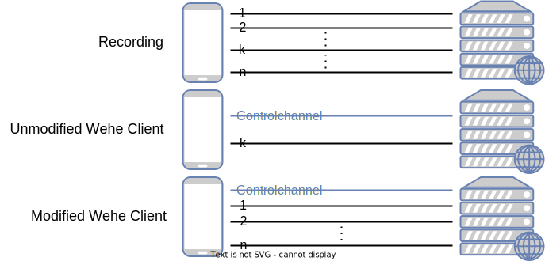

# Modified Wehe Command Line Client for MobileAtlas

This repository contains a modified version of the
[Wehe command-line client](https://github.com/NEU-SNS/wehe-cmdline) used to detect economic
differentiation in mobile networks via traffic replaying using the MobileAtlas measurement platform.

A brief overview of both the Wehe and MobileAtlas projects can be found in the [repository of the
modified Wehe server](https://github.com/phfrenzel/wehe-server#project-overview).

## Changes to the Client

### Removal of Analysis Retrieval Logic

Since we are interested in economic differentiation and not in the throttling of network traffic, we
do not use the analysis server provided by Wehe and thus removed the logic responsible for
requesting/retrieving results from it.

### Removing Randomised Test Runs

Wehe compares measured throughput information between two replays: One where recorded traffic is
replayed unaltered and one where payloads are randomised. However, for our work on economic
differentiation, we do not need these randomised replays since we only need to retrieve billing
information from the MNO.

### Support for multiple TCP and UDP conversations per test

Initially, Wehe supported only one TCP/UDP conversation per Test. Our changes make it possible to
create tests from PCAP files that contain many TCP and UDP streams and thus allow tests to better
reflect the behaviour of the actual applications.

<picture>
  <source media="(prefers-color-scheme: dark)" srcset="./graphics/ModifiedWehe-whitebg.svg">
  <source media="(prefers-color-scheme: light)" srcset="./graphics/ModifiedWehe.svg">
  
</picture>

### Removal of Websocket Dependency/M-Lab

Since we do not use [M-Lab](https://www.measurementlab.net/tests/wehe/) for our tests we were able
to remove the dependency on the
[Tyrus](https://mvnrepository.com/artifact/org.glassfish.tyrus.bundles/tyrus-standalone-client)
Websocket library which was only used in supporting M-Lab.

<!--config update-->

## Adding new Tests

New tests can be created by following these steps:

1. Follow the
   [instructions](https://github.com/phfrenzel/wehe-server#adding-new-tests)
   found in the wehe-server repository to generate the necessary files.
2. Move the generated file called `<testname>.client_all.json` into the `res/` folder
3. Add a new entry in the `apps_list.json` file:
   ```json
   {
     "name": "<testname>",
     "time": <time before test times out in seconds>,
     "image": "<testname>",
     "category": "",
     "randomdatafile": "",
     "datafile": "<testname>.pcap_client_all.json"
   }
   ```

## About the Code

* The code is based off of the Wehe [Android Client](https://github.com/NEU-SNS/wehe-android). 
* Building the source code requires an additional library: 
  [JSON](https://github.com/stleary/JSON-java)
  ([Maven repo](https://mvnrepository.com/artifact/org.json/json/20201115)).
* The `src/` directory contains the source files.
* The `res/` directory contains the app and port client traffic for the tests.
* The code runs one test for each shell command.

## Running the client

There are two ways to run the code:

1) Run the jar file (`wehe-cmdline.jar`)
2) Build from source (use Java 11)
3) Use docker to build a container image

A compiled jar comes with the repo (`wehe-cmdline.jar`). This jar was compiled using Java 11.

### Usage

Usage: `java -jar wehe-cmdline.jar -s <SERVER_IPS> -n <TEST_NAME> [OPTION]...`

Example: `java -jar wehe-cmdline.jar -s 192.0.2.15,2001:db8::15 -n snapchat_misc -r results/ -l info`

**Options**

`-n TEST_NAME` - The name of the test to run. **Argument required. See below for list of test names.**

`-s SERV_NAME` - The hostname or IP of server to run the tests. Default: `wehe4.meddle.mobi`.

`-t RESR_ROOT` - The resources root containing `apps_list.json` and the tests. No need to change 
this if using the jar or if you don't move the `res/` directory. Default: `res/`.

`-r RSLT_ROOT` - The results root containing the output logs and info. Default: `test_results/`.

`-l LOG_LEVEL` - The level of logs and above that should be printed to console (all levels will be 
saved to logs on disk regardless of the level printed to console). Choose from `wtf`, `error`, 
`warn`, `info`, or `debug`. Default: none of these, only `UI` logs (what the user would see on screen
when running the Android app) will be printed to the console.

`-h` - Print the help message.

`-v` - Print the version number.

**Provided Tests**

| Test Names (`-n` arg)             |
|-----------------------------------|
| fm4\_favorite\_1                  |
| fm4\_flow\_1                      |
| fm4\_misc\_1                      |
| fm4\_misc\_2                      |
| fm4\_programme\_1                 |
| fm4\_radio\_1                     |
| fm4\_stories\_scroll\_1           |
| fm4web\_misc\_1                   |
| fm4web\_misc\_2                   |
| iphone\_idle                      |
| snapchat\_chat\_1                 |
| snapchat\_map\_1                  |
| snapchat\_misc                    |
| snapchat\_snap\_video\_1          |
| snapchat\_spotlight\_1            |
| whatsapp\_incoming\_call\_1       |
| whatsapp\_incoming\_video\_1      |
| whatsapp\_misc                    |
| whatsapp\_outgoing\_call\_1       |
| whatsapp\_outgoing\_video\_1      |
| fm4web\_live\_1\_android          |
| fm4web\_misc\_1\_android          |
| messenger\_chat\_1                |
| messenger\_misc\_1                |
| messenger\_chat\_1\_android       |
| messenger\_misc\_1\_android       |
| messenger\_chat\_1\_android\_ipv4 |
| messenger\_misc\_1\_android\_ipv4 |
| messenger\_android\_z\_p4         |

### Output

Output is contained in `RSLT_ROOT`:

* By default, the name of `RSLT_ROOT` is `res/` (change the directory name using the `-r` option).
* `info.txt` - This file contains the user's random ID and the current history count.
* `logs/` - This directory contains the logs that would be printed to the Android logs (think of 
  Android's Log class).
  * Log files are the in the format `logs_<randomID>_<historyCount>_<exitCode>.txt`.
* `ui/` - This directory contains the text that a user running the Android client would see on 
  his/her screen.
  * Log files are in the format `ui_<randomID>_<historyCount>_<exitCode>.txt`.

**Exit Codes**

Each error exit code corresponds to a specific spot in the code where execution of the tests was
terminated. CTRL+F the exit status on the code base to find where each of these locations are
located.

| Exit Code | Exit Status         | Explanation                                                   |
|-----------|---------------------|---------------------------------------------------------------|
| 0         | `SUCCESS`           | No errors occurred during the test.                           |
| 1         | `ERR_GENERAL`       | An error occurred that does not fit any below.                |
| 2         | `ERR_CMDLINE`       | Invalid command line input.                                   |
| 3         | `ERR_INFO_RD`       | Error reading from `info.txt`.                                |
| 4         | `ERR_INFO_WR`       | Error writing to `info.txt`.                                  |
| 5         | `ERR_WR_LOGS`       | Error writing to the logs.                                    |
| 6         | `ERR_CONN_IP`       | Error connecting to server because IP not found.              |
| 7         | `ERR_CONN_INST`     | Error getting instance of TCP or UDP socket to send data.     |
| 8         | `ERR_CONN_IO_SERV`  | IO issue with the SideChannel.                                |
| 9         | `ERR_CONN_WS`       | Error connecting to WebSocket.                                |
| 10        | `ERR_UNK_HOST`      | Error connecting to the server.                               |
| 11        | `ERR_UNK_META_HOST` | Error connecting to metadata server.                          |
| 12        | `ERR_CERT`          | Error with the certificates.                                  |
| 13        | `ERR_NO_ID`         | No random ID found.                                           |
| 14        | `ERR_NO_TEST`       | Test not found on client.                                     |
| 15        | `ERR_PERM_REPLAY`   | Test not found on server.                                     |
| 16        | `ERR_PERM_IP`       | Another user with the same IP is running tests on the server. |
| 17        | `ERR_PERM_RES`      | Server is low on resources.                                   |
| 18        | `ERR_PERM_UNK`      | Unknown server error.                                         |
| 19        | `ERR_ANA_NULL`      | No analysis status returned.                                  |
| 20        | `ERR_ANA_NO_SUC`    | Analysis did not succeed.                                     |
| 21        | `ERR_ANA_HIST_CT`   | Invalid analysis history count.                               |
| 22        | `ERR_RSLT_NULL`     | No result status returned.                                    |
| 23        | `ERR_RSLT_NO_RESP`  | Result succeed, but result was not sent.                      |
| 24        | `ERR_RSLT_NO_SUC`   | Result not found.                                             |
| 25        | `ERR_RSLT_ID_HC`    | Result returned wrong random ID or history count.             |
| 26        | `ERR_BAD_JSON`      | JSON error.                                                   |

**NOTE:** If the Exit Code is negative, then two errors occurred: the number in the Exit Code and 
`ERR_WR_LOGS`. For example, `-24` means no result was found and the logs could not be written to disk.

## Funding

This project is funded through the [NGI0 PET](https://nlnet.nl/PET) Fund, a fund established by
NLnet with financial support from the European Commission's [Next Generation
Internet](https://ngi.eu/) programme, under the aegis of DG Communications Networks, Content and
Technology under grant agreement No 825310.
